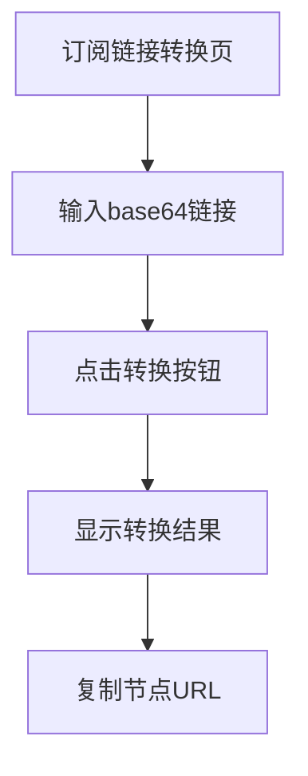

## 1. 产品概述

Base64订阅链接转换器是Actrue-tool工具集合中的新增功能，专门用于将base64编码的订阅链接转换成Clash代理工具能够识别和使用的节点URL格式。
- 解决用户在使用代理服务时需要手动转换订阅链接格式的问题，提供一键转换功能。
- 目标是为代理工具用户提供便捷的订阅链接格式转换服务，提升用户体验。

## 2. 核心功能

### 2.1 用户角色

| 角色 | 注册方式 | 核心权限 |
|------|----------|----------|
| 普通用户 | 无需注册，直接访问 | 可使用订阅链接转换功能 |

### 2.2 功能模块

我们的Base64订阅链接转换器包含以下主要页面：
1. **订阅链接转换页**：输入base64编码链接，转换为Clash格式节点URL

### 2.3 页面详情

| 页面名称 | 模块名称 | 功能描述 |
|----------|----------|----------|
| 订阅链接转换页 | 输入模块 | 提供文本输入框，支持粘贴base64编码的订阅链接 |
| 订阅链接转换页 | 转换模块 | 解码base64内容，解析订阅信息，转换为Clash格式 |
| 订阅链接转换页 | 结果展示模块 | 显示转换后的节点URL列表，支持复制功能 |
| 订阅链接转换页 | 示例模块 | 提供示例链接和使用说明 |

## 3. 核心流程

用户操作流程：
1. 用户访问订阅链接转换页面
2. 在输入框中粘贴或输入base64编码的订阅链接
3. 点击转换按钮执行转换操作
4. 查看转换结果，复制所需的节点URL
5. 将转换后的URL导入到Clash等代理工具中使用

## 4. 用户界面设计

### 4.1 设计风格

- 主色调：蓝色系（#3B82F6, #1E40AF）
- 辅助色：灰色系（#6B7280, #F3F4F6）
- 按钮风格：圆角矩形，悬停效果
- 字体：系统默认字体，标题使用较大字号（2xl）
- 布局风格：卡片式设计，垂直布局
- 图标风格：简洁的线性图标，使用🎬等emoji增强视觉效果

### 4.2 页面设计概览

| 页面名称 | 模块名称 | UI元素 |
|----------|----------|--------|
| 订阅链接转换页 | 标题区域 | 页面标题"🎬 Base64订阅链接转换器"，简洁说明文字 |
| 订阅链接转换页 | 输入区域 | 大型文本输入框，占位符提示，粘贴按钮 |
| 订阅链接转换页 | 操作区域 | 蓝色转换按钮，清空按钮 |
| 订阅链接转换页 | 结果区域 | 节点列表卡片，每个节点包含复制按钮 |
| 订阅链接转换页 | 示例区域 | 折叠式示例说明，使用说明文档链接 |

### 4.3 响应式设计

产品采用移动优先的响应式设计，支持桌面端和移动端访问，输入框和按钮针对触摸操作进行了优化。