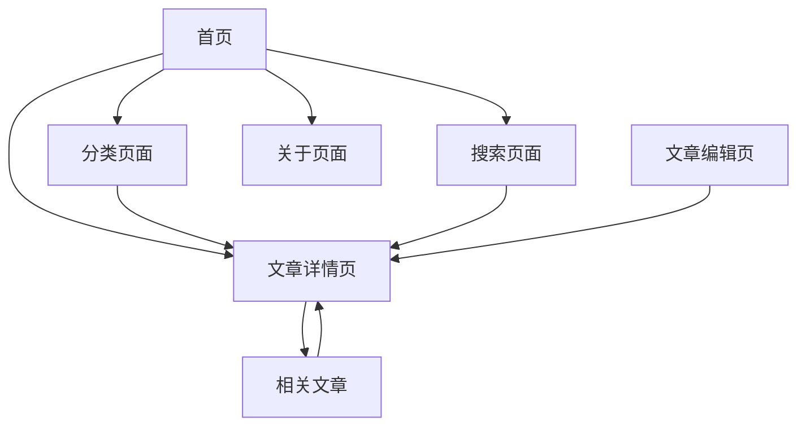

## 1. Product Overview

基于ollama.com设计风格的个人博客系统，提供简洁现代的博客写作和阅读体验。

* 采用ollama网站的极简设计理念，专注于内容展示和用户体验，支持技术文章发布和管理。

* 面向技术博主和内容创作者，提供高效的写作工具和优雅的阅读界面。

## 2. Core Features

### 2.1 User Roles

| Role | Registration Method | Core Permissions  |
| ---- | ------------------- | ----------------- |
| 默认用户 | 无需注册                | 可浏览所有文章、搜索内容、查看分类 |
| 博主   | 管理员设置               | 可发布文章、编辑内容、管理分类标签 |

### 2.2 Feature Module

我们的ollama风格个人博客包含以下主要页面：

1. **首页**: hero区域展示、导航菜单、文章列表、分类标签
2. **文章详情页**: 文章内容展示、代码高亮、目录导航、相关推荐
3. **分类页面**: 按分类筛选文章、标签云展示
4. **搜索页面**: 全文搜索功能、搜索结果展示
5. **关于页面**: 个人介绍、联系方式、技能展示
6. **文章编辑页**: Markdown编辑器、实时预览、草稿保存

### 2.3 Page Details

| Page Name | Module Name | Feature description              |
| --------- | ----------- | -------------------------------- |
| 首页        | Hero区域      | 展示个人简介和核心技能，采用ollama风格的渐变背景和简洁排版 |
| 首页        | 导航菜单        | 顶部固定导航，包含首页、分类、搜索、关于等链接          |
| 首页        | 文章列表        | 显示最新文章卡片，包含标题、摘要、发布时间、标签         |
| 首页        | 分类标签        | 展示热门标签云，支持点击筛选                   |
| 文章详情页     | 文章内容        | 支持Markdown渲染、代码语法高亮、图片展示         |
| 文章详情页     | 目录导航        | 自动生成文章目录，支持锚点跳转                  |
| 文章详情页     | 相关推荐        | 基于标签推荐相关文章                       |
| 分类页面      | 分类筛选        | 按技术分类展示文章，支持多级分类                 |
| 分类页面      | 标签管理        | 展示所有标签，支持标签组合筛选                  |
| 搜索页面      | 搜索功能        | 全文搜索文章标题和内容                      |
| 搜索页面      | 结果展示        | 高亮搜索关键词，分页显示结果                   |
| 关于页面      | 个人介绍        | 展示个人技能、经历、项目经验                   |
| 关于页面      | 联系方式        | 提供邮箱、GitHub、社交媒体链接               |
| 文章编辑页     | Markdown编辑器 | 支持实时预览、语法高亮、快捷键操作                |
| 文章编辑页     | 草稿管理        | 自动保存草稿、发布管理、SEO设置                |

## 3. Core Process

**访客浏览流程：**
访客进入首页 → 浏览文章列表或使用搜索 → 点击感兴趣的文章 → 阅读文章详情 → 通过相关推荐或分类继续浏览

**博主管理流程：**
博主登录 → 进入编辑页面 → 使用Markdown编辑器写作 → 设置分类标签 → 预览文章 → 发布或保存草稿



## 4. User Interface Design

### 4.1 Design Style

* **主色调**: 白色背景 (#ffffff) 配合黑色文字 (#000000)，强调色使用深色按钮 (#000000)

* **按钮样式**: 深色圆角按钮，白色文字，悬停时轻微透明度变化，采用ollama风格的极简设计

* **字体**: 主标题和正文都使用系统默认字体，保持简洁统一，代码使用等宽字体

* **布局风格**: 极简居中布局，大量留白，去除多余装饰，响应式设计

* **图标风格**: 使用简洁的黑色线性图标，与ollama网站保持一致的极简风格

### 4.2 Page Design Overview

| Page Name | Module Name | UI Elements                    |
| --------- | ----------- | ------------------------------ |
| 首页        | Hero区域      | 纯白背景，大标题黑色字体，副标题灰色，CTA按钮黑色背景白色文字 |
| 首页        | 文章列表        | 纯白背景，无阴影，标题黑色，摘要灰色，标签简洁边框样式   |
| 文章详情页     | 内容区域        | 纯白背景，黑色正文，代码块浅灰背景，语法高亮使用灰度色彩       |
| 文章详情页     | 目录导航        | 简洁侧边栏，当前章节黑色高亮                 |
| 编辑页面      | Markdown编辑器 | 分屏布局，左右两侧都是白色背景，黑色文字       |

### 4.3 Responsiveness

采用移动优先的响应式设计，在桌面端提供最佳阅读体验，移动端优化触摸交互和阅读体验。统一使用白底黑字的简约风格，无需主题切换。

## 5. 数据存储方案

### 5.1 博客文章数据结构

每个博客文章使用独立的TypeScript文件存储，文件命名格式：`文章标题.ts`

**文章数据接口定义：**

```typescript
interface BlogPost {
  // 页面元数据
  title: string;           // 文章标题
  description: string;     // 页面描述（用于HTML head中的meta description）
  keywords: string[];      // 页面关键词（用于HTML head中的meta keywords）
  
  // 文章信息
  author: string;          // 作者
  publishDate: string;     // 发布日期 (YYYY-MM-DD格式)
  updateDate?: string;     // 更新日期 (YYYY-MM-DD格式)
  category: string;        // 文章分类
  tags: string[];          // 文章标签
  
  // 文章内容
  content: string;         // 文章正文（Markdown格式）
  
  // 可选字段
  coverImage?: string;     // 封面图片URL
  excerpt?: string;        // 文章摘要
  readTime?: number;       // 预估阅读时间（分钟）
  isPublished: boolean;    // 是否发布
}
```

### 5.2 文章文件示例

```typescript
// 文件路径: /data/posts/Next.js入门指南.ts
export const post: BlogPost = {
  title: "Next.js入门指南",
  description: "详细介绍Next.js框架的基础概念、安装配置和核心功能，适合初学者快速上手",
  keywords: ["Next.js", "React", "前端框架", "SSR", "教程"],
  
  author: "博主姓名",
  publishDate: "2024-01-15",
  category: "前端开发",
  tags: ["Next.js", "React", "JavaScript"],
  
  content: `
# Next.js入门指南

## 什么是Next.js

Next.js是一个基于React的全栈框架...

## 安装和配置

\`\`\`bash
npx create-next-app@latest my-app
\`\`\`

## 核心功能

### 1. 服务端渲染(SSR)
...
  `,
  
  coverImage: "/images/nextjs-cover.jpg",
  excerpt: "学习Next.js框架的完整指南，从安装到部署",
  readTime: 8,
  isPublished: true
};
```

### 5.3 数据管理

* **文章索引**: 创建 `posts/index.ts` 文件，导出所有文章的元数据用于列表展示

* **分类管理**: 创建 `categories.ts` 文件，定义所有文章分类

* **标签管理**: 创建 `tags.ts` 文件，定义所有可用标签

* **配置文件**: 创建 `blog.config.ts` 文件，存储博客基础配置信息

### 5.4 SEO优化

每个页面的HTML head部分将包含：

* `<title>` 标签：使用文章的title字段

* `<meta name="description">` 标签：使用文章的description字段

* `<meta name="keywords">` 标签：使用文章的keywords字段

* Open Graph标签：用于社交媒体分享

* JSON-LD结构化数据：提升搜索引擎理解

