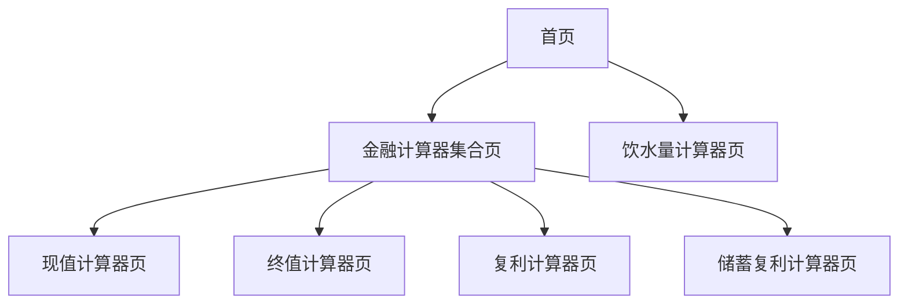

## 1. 产品概述

Actrue-tool 是一个基于 Next.js 的多功能工具集合平台，主要提供金融计算和生活实用工具。
- 解决用户在金融投资规划和日常生活中的计算需求，为个人理财和健康管理提供科学的计算工具。
- 目标是成为用户日常生活中不可或缺的实用工具平台，提升用户的生活质量和理财效率。

## 2. 核心功能

### 2.1 用户角色

| 角色 | 注册方式 | 核心权限 |
|------|----------|----------|
| 普通用户 | 无需注册，直接访问 | 可使用所有计算工具和功能 |

### 2.2 功能模块

我们的工具集包含以下主要页面：
1. **首页**：产品介绍、功能导航
2. **金融计算器集合页**：各类金融计算工具的入口
3. **现值计算器页**：计算资金当前价值
4. **终值计算器页**：预测资金未来价值
5. **复利计算器页**：计算复利增长效果
6. **储蓄复利计算器页**：定期定额投资复利计算
7. **饮水量计算器页**：个人每日饮水量计算

### 2.3 页面详情

| 页面名称 | 模块名称 | 功能描述 |
|----------|----------|----------|
| 首页 | 导航模块 | 展示产品介绍，提供各功能模块的快速入口 |
| 金融计算器集合页 | 工具导航 | 展示所有金融计算工具卡片，包含工具说明和公式展示 |
| 现值计算器页 | 计算模块 | 输入终值、利率、期数，计算现值。公式：PV = FV/(1+r)^n |
| 终值计算器页 | 计算模块 | 输入现值、利率、期数，计算终值。公式：FV = PV×(1+r)^n |
| 复利计算器页 | 计算模块 | 输入本金、利率、复利次数、时间，计算复利结果 |
| 储蓄复利计算器页 | 计算模块 | 输入定投金额、年增长率、目标金额，计算所需年数和收益对比 |
| 储蓄复利计算器页 | 图表模块 | 显示名义收益与实际收益对比图表，支持通胀率调整 |
| 饮水量计算器页 | 计算模块 | 输入性别、年龄、体重、身高、活动系数，计算每日所需饮水量 |

## 3. 核心流程

用户主要操作流程：
1. 用户访问首页，了解产品功能
2. 选择所需的计算工具类型（金融计算或生活工具）
3. 进入具体的计算器页面
4. 输入相关参数进行计算
5. 查看计算结果和相关图表（如适用）

## 4. 用户界面设计

### 4.1 设计风格

- 主色调：蓝色系（#3B82F6, #1E40AF）
- 辅助色：灰色系（#6B7280, #F3F4F6）
- 按钮风格：圆角矩形，悬停效果
- 字体：系统默认字体，标题使用较大字号（2xl, 4xl）
- 布局风格：卡片式设计，网格布局，响应式设计
- 图标风格：简洁的线性图标，支持SVG格式

### 4.2 页面设计概览

| 页面名称 | 模块名称 | UI元素 |
|----------|----------|--------|
| 首页 | 导航模块 | 简洁的标题，功能入口按钮，蓝色主题色调 |
| 金融计算器集合页 | 工具卡片 | 3列网格布局，白色卡片背景，阴影效果，悬停动画 |
| 计算器页面 | 输入表单 | 清晰的标签，数字输入框，蓝色提交按钮 |
| 计算器页面 | 结果展示 | 突出显示计算结果，使用卡片容器 |
| 储蓄复利计算器页 | 图表区域 | Chart.js图表，支持数据可视化，响应式设计 |

### 4.3 响应式设计

产品采用移动优先的响应式设计，支持桌面端和移动端访问，针对触摸操作进行了优化。